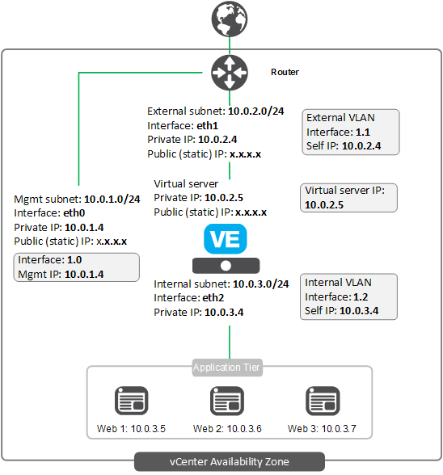

# Deploying the BIG-IP in VMware vCenter - 1-4 NIC (nNIC)

[](https://f5cloudsolutions.herokuapp.com)

## Contents

- [Introduction](#introduction)
- [Prerequisites](#prerequisites-and-notes)
- [Security](#security)
- [Deploying the Template](#downloading-and-deploying-the-template)

## Introduction

This solution uses a VMware Template to launch a 1, 2, 3, or 4 NIC deployment of a BIG-IP VE in a Private VMware vCenter. Traffic flows from the BIG-IP VE to the application servers. This is the standard "on-premise like" design where the compute instance of F5 is running with a management, front-end application traffic (virtual server), and a back-end application interface.

The BIG-IP VE has the <a href="https://f5.com/products/big-ip/local-traffic-manager-ltm">Local Traffic Manager</a> (LTM) module enabled to provide advanced traffic management functionality. This means you can also configure the BIG-IP VE to enable F5's L4/L7 security features, access control, and intelligent traffic management.

You have the option of using a [BIG-IQ device](https://f5.com/products/big-iq-centralized-management) with a pool of BIG-IP licenses in order to license BIG-IP VEs using BYOL licenses.

The **existing stack** VMware template incorporates existing networks.

## Prerequisites and notes

The following are prerequisites and configuration notes for the F5 nNIC VMware template:

- You must have downloaded a supported BIG-IP VE (13.1+) and uncompressed the image (see [OVA to OVF instructions](#ova-to-ovf-instructions)).
- vCenter 6.0 or later with content libraries enabled (see [Content Library Information](#content-library-information)).
- A client which supports Node 6.9.5 or higher (see step 2 in the [Example Client Setup](#example-client-setup-using-ubuntu-16043)).
- You must have a F5 Networks BYOL license (Bring Your Own License) available, or a BIG-IQ configured as a license manager.
- 1-4 vCenter defined networks. When using BYOL licensing and the default cloud-lib URL, the subnet for the management network requires a route and access to the Internet for the initial configuration to download the BIG-IP cloud library. This is not required when using the internal file server with BIG-IP  licensing.
- The system used to create the BIG-IP VE must have access to the management address assigned to BIG-IP VE.
- Firewall rules with the following inbound rules:  
  - Port 22 for SSH access to the BIG-IP VE.
  - Port 443 (or other port, use 8443 when using 1 NIC) for accessing the BIG-IP web-based Configuration utility.  
  - A port for accessing your applications via defined BIG-IP virtual servers.  
- If you choose to use a BIG-IQ device in order to license BIG-IP VEs, note this solution supports the two most recent versions of BIG-IQ, your BIG-IQ system must have at least 2 NICs, and you must have an existing license pool with BIG-IP VE BYOL licenses.  **Note:** The templates now support BIG-IQ licensing using an [ELA](https://www.f5.com/pdf/licensing/big-ip-virtual-edition-enterprise-licensing-agreement-overview.pdf)/[CLPv2]( https://f5.com/partners/cloud-provider) pool, which enables self-licensing of BIG-IP virtual editions (VEs).

### Security

This  VMware template downloads helper code to configure the BIG-IP system. If you want to verify the integrity of the template, you can open the VMware template and associated scripting and ensure the following lines are present. See [Security Detail](#securitydetail) for the code snippet in each of the following sections.

- In the *lib/verifyHash* file: **script-signature** and then a hashed signature
- In the *lib/installCloudLibs.sh* file **"tmsh load sys config merge file /config/verifyHash"**
  
Additionally, F5 provides a checksum for the downloaded VMware template package.  **Important**: Verify the downloaded package available in the **dist** folder matches the SHA-512 hash found in the file named **packageHash** in the same folder.

```openssl dgst -sha512 dist/f5-vmware-vcenter-templates.tar.gz | cut -d ' ' -f 2```
  
### Help

Because this template has been created and fully tested by F5 Networks, it is fully supported by F5. This means you can get assistance if necessary from [F5 Technical Support](https://support.f5.com/csp/article/K25327565). You can modify the template itself if necessary, but if you modify any of the code outside of the lines ### START CUSTOM TMSH CONFIGURATION and ### END CUSTOM TMSH CONFIGURATION the template is no longer supported by F5.

**Community Support**  
We encourage you to use our [Slack channel](https://f5cloudsolutions.herokuapp.com) for discussion and assistance on F5 VMware templates. There are F5 employees who are members of this community who typically monitor the channel Monday-Friday 9-5 PST and will offer best-effort assistance. This slack channel community support should **not** be considered a substitute for F5 Technical Support. See the [Slack Channel Statement](https://github.com/F5Networks/f5-vmware-vcenter-templates/blob/master/slack-channel-statement.md) for guidelines on using this channel.

## Downloading and deploying the template

Use the following guidance for downloading and deploying this template.

### Downloading the template

Use the following command syntax to download the template.

``` sh

curl -f -o /<local directory>/f5-vmware-vcenter-templates.tar.gz https://raw.githubusercontent.com/F5Networks/f5-vmware-vcenter-templates/master/dist/f5-vmware-vcenter-templates.tar.gz

```

### OVA to OVF instructions

- Use tar to uncompact your OVA
  - ```tar -xf <path/name_of_ova_file.ova>```
- You should now have 5 files with format: ```<name_of_ova_file.ovf, .cert, .mf, disk1.vmdk, and disk2.vmdk> ``` 
- Modify the .ovf file and add the following properties to **\<ProductSection>**:

  ``` xml

  <Category>Network properties</Category>  
    <Property ovf:key="net.mgmt.addr" ovf:type="string" ovf:value="" ovf:userConfigurable="true">
      <Label>mgmt-addr</Label>
      <Description>F5 BIG-IP VE's management address in the format of "IP/prefix"</Description>
    </Property>
    <Property ovf:key="net.mgmt.gw" ovf:type="string" ovf:value="" ovf:userConfigurable="true">
      <Label>mgmt-gw</Label>
      <Description>F5 BIG-IP VE's management default gateway</Description>
    </Property>
  <Category>User properties</Category>
    <Property ovf:key="user.root.pwd" ovf:type="string" ovf:value="" ovf:userConfigurable="true">
      <Label>root-pwd</Label>
      <Description>F5 BIG-IP VE's SHA-512 shadow or plain-text password for "root" user</Description>
    </Property>
    <Property ovf:key="user.admin.pwd" ovf:type="string" ovf:value="" ovf:userConfigurable="true">
      <Label>admin-pwd</Label>
      <Description>F5 BIG-IP VE's SHA-512 shadow or plain-text password for "admin" user</Description>
    </Property>

  ```

### Content library information

This section contains content library guidance.  For information on VMware content libraries and performance, see https://blogs.vmware.com/performance/2015/07/efficiently-deploy-vms-vmware-vsphere-content-library.html.  

  1. Create a local content library  
     - Click **Content Libraries**.  
     - Click **Create new content library**.
     - Give the content library a name and then click **Next**.
     - Leave the default **Local content library** and then click **Next**.
     - Select a datastore (use a fast datastore, otherwise VE creations can be really slow), and then click **Next**.
     - Click **Finish**.
     - You should now notice a content library with the name you specified.

  2. Upload the OVF into the content library
     - Click your content library.  
     - Click **Import item**.
     - Under Local File, click **Browse** and then select the location of your OVF file.
     - Click **Open**.
     - Should see a new window pop open that looks similar to:    
     - Click **Browse** to locate the required **vmdk** files,
     - Highlight both files and then click **Open**.
     - Note green check marks now located next to each required file .
     - Click **Ok**.
     - Note and/or change the item name.
     - Click **Ok** to upload the BIG-IP VE image into the content library.

### Example Client setup using Ubuntu 16.04.3

The following contains an example of the client setup using Ubuntu, however it should work on any MAC/Linux system that supports the requirements below):

1. Download the vCenter template distribution:
    - ```curl -f -o /<local directory>/f5-vmware-vcenter-templates.tar.gz https://raw.githubusercontent.com/F5Networks/f5-vmware-vcenter-templates/master/dist/f5-vmware-vcenter-templates.tar.gz```
    - Important: Verify the downloaded package matches the SHA-512 hash found in the file **packageHash** in the **dist** folder: ```openssl dgst -sha512 dist/f5-vmware-vcenter-templates.tar.gz | cut -d ' ' -f 2```
    - Run the tar command: ```tar xvfz /<local directory> /f5-vmware-vcenter-templates.tar.gz -C /<local directory>```

2. Node and required package install (distro-stable version):
    - ```sudo apt-get update```
    - ```sudo apt-get install nodejs```
    - ```sudo apt-get install npm```

3. Modify the **settings.js** for the template you want to use (see [Example Script](#example-script))

4. Run standalone solution:
    - Change directory to script you want to run, for example: **supported/standalone/n-nic/existing-stack**.
    - Run the script, for example ```node f5-existing-stack-nNic-bigip.js <settings_filename>``` (you are required to specify the file to use for configuration settings).
    - The script prompts you for credentials.  Type the appropriate credentials for vCenter, BIG-IP, and BIG-IQ if applicable.

#### Example script

``` javascript

// Version v1.2.0
 // This file contains required configuration parameters used in f5 standalone template. Note most parameters are case sensitive.

 module.exports = {
  //vCenter parameters
  host: 'https://<vCenter_url>', //No default! Please provide a valid host URL.
  datacenter: '<datacenter name>', // the name of the datacenter in which to provision vm
  datastore: '<datastore name>', // the name of a datastore used to build vm
  contentlibName: '<content library name>', // content library which contains big-ip ovf to deploy
  contentlibItem: '<content library template name >', //name of template in content library used to deploy BIG-IP
  managementNetwork: '<name of management network>', // vCenter network name used for management interface ***Note: network is required to have internet access
  internalNetwork: '<name of internal network>', // vCenter network name used for internal BIG-IP interface. Network contains internal/application traffic or route to internal application traffic.
  externalNetwork: '<name of external network>', // vCenter network name used for external BIG-IP interface. Network contains external traffic or route to external traffic.
  haNetwork: '<name of ha network>', // vCenter network used for HA
  resourcePool: '<name of resource pool>', // Resource pool used for this vm - "Resources" is default
  vmName: '<name to use for new VE>', // a name of a VM and hostname of BIG-IP
  ssl: true, // use strict ssl or not.. false allows you to accept all certs.
              // NOTE: SSL should be set to true in a production environment.

  //Logging parameters
  logConsole: true, // log messages to console
  logLevel: 'info', // log message level (error, warn, info, verbose, debug, silly).

  // BIG-IP Specific information
  // Device settings
  vmFqdn: '<fqdn>', // BIG-IP VE FQDN
  ntp: '<ntp server url>', // URL to use for NTP
  timezone: '<UTC>', // specify time zone, ie US/Pacific
  dnsAddresses: '<DNS list', // list of server IP addresses to use for DNS
  cloudlibUrl: 'https://raw.githubusercontent.com/F5Networks/f5-cloud-libs/v4.1.1/dist/f5-cloud-libs.tar.gz', // list url used to download cloud-libs node library.
                // The default is listed as public github repository, specify alternate url if public internet from big-ip management network is not available.
                // **Note cloud-lib version is specific to this template release and requires the cloud-lib release specified in default url be used.
  
  // BIG-IP licensing using BIG-IQ
  bigIqAddress: '<BIG-IQ Management ip address>',   // optional - list BIG-IQ management address or FQDN to use for licensing BIG-IP's. ** Leave blank if using license keys!
  bigIqLicensePoolName: '<BIG-IQ licensing pool>', // Name of BIG-IQ license pool
  bigIqLicenseSkuKeyword1:  '<SKU>', // optional - BIG-IQ offers Enterprise license aggreement pool types which require SKU name determine which license type to apply to BIG-IP. 
  bigIqLicenseUnitOfMeasure: '<license duration>', // optional - Enter license duration: yearly, monthly, daily, hourly.
  
  // BIG-IP licensing using license key
  lickey1: '',  // If not using BIG-IQ to license BIG-IP's, list first BIG-IP License key (vmName). Leave blank if using BIG-IQ!
                // **Note this option uses auto registration which requires BIG-IP management network allow access to F5 public registration server.
  
  numberNics: '4', // Indicate number of desired network interfaces (currently supports up to 4).
  // Management network settings (1st nic)
  mgmtIpAddress: '<1st mgmt ip address>', // IP address used to manage first BIG-IP (vmName)
  mgmtPrefix: '<mgmt prefix>', // mgmt subnet prefix
  mgmtGwAddress: '<mgmt gw address>', // management gw address
  
  // Public or external settings (2nd nic)
  extIpAddress: '<1st ext ip address>', // First BIG-IP self IP (non-floating) used on external network (vmName)
  extPrefix: '<ext prefix>', // external subnet prefix
  extGw: '<ext gw>', // default gateway for tmm traffic
  extVlan: '<ext vlan>', // optional - tagged VLAN for external subnet. **Leave blank if vlan is untagged. 
  
  // Internal or private settings (3rd nic)
  intIpAddress: '<1st int ip address>', // First BIG-IP self IP (non-floating) used on internal network (vmName)
  intPrefix: '<int prefix>', // prefix for internal subnet
  intVlan: '<int vlan>', // optional - tagged VLAN for internal subnet. **Leave blank if vlan is untagged.
  
  // HA settings (4th nic)
  haIpAddress: '<1st ha ip address>', // First BIG-IP self IP (non-floating) used on ha network (vmName)
  haPrefix: '<ha previx>', // prefix for HA subnet
  haVlan: '<ha vlan>', // optional - tagged VLAN for HA subnet. **Leave blank if vlan is untagged.
}

```

## Configuration Example

The following is a simple configuration diagram for this N-NIC deployment. In this diagram, the IP addresses are provided as examples. <br>


## Security Details <a name="securitydetail"></a>

This section has code snippets for each of the lines you should ensure are present in your template file if you want to verify the integrity of the helper code in the template.

### verifyHash file

Note the hashes and script-signature may be different in your template. The important thing to check is that there is a script-signature line present in the location.

``` sh

cli script /Common/verifyHash {
proc script::run {} {
        if {[catch {
            set hashes(f5-cloud-libs.tar.gz) dd2dbd1375f6fff639f87cd2ba781e9e09cd193c52b40a57697809a73658706f559a1825eede891590db4443cc33f89d76928f55034d352facd157e61ed3bb88
        }]} {
            tmsh::log err {Unexpected error in verifyHash}
            exit 1
        }
    }
    script-signature O+tf8OQziIu9bjatG6z35/qd8lx2wn2pgWBxRm5l2SpJ6LWuYSitk7VNqUpxz2iH/pq7Vrc8d1P/FGq4IoZUGRh5D94OHyODXc02pe/o+sla5g826xjHUrDfCAMval31cg7CRZ/htVx+bhpdiKhg4Zfypgg0USF1mKE9g8bEdvIKbPlWil4HIymEKV7gbq7ZbK86Mn0V05+B72D/k8ER/Lman0dle1XB3iHkiOBj2Qm9PPhNtvxS6ean0MDGoIrTewfIT41OSrDUd5YKrXt4Ee4YF8++8a2UBAW+UMGMibxF+vVLTxXUUM5/20goExy9yGkjHKHEVyS+9cJ40kdg9A==
    signing-key /Common/f5-irule
}

```

### installCloudLibs file

```sh

#!/bin/bash
echo about to execute
checks=0
while [ $checks -lt 120 ]; do echo checking mcpd
    tmsh -a show sys mcp-state field-fmt | grep -q running
    if [ $? == 0 ]; then
        echo mcpd ready
        break
    fi
    echo mcpd not ready yet
    let checks=checks+1
    sleep 10
done
echo loading verifyHash script
if ! tmsh load sys config merge file /config/cloud/vmware/verifyHash; then
    echo cannot validate signature of /config/cloud/vmware/verifyHash
    exit
fi
echo loaded verifyHash
declare -a filesToVerify=("/config/cloud/vmware/f5-cloud-libs.tar.gz")
for fileToVerify in "${filesToVerify[@]}"
do
    echo verifying "$fileToVerify"
    if ! tmsh run cli script verifyHash "$fileToVerify"; then
        echo "$fileToVerify" is not valid
        exit 1
    fi
    echo verified "$fileToVerify"
done
mkdir -p /config/cloud/vmware/node_modules
echo expanding f5-cloud-libs.tar.gz
tar xvfz /config/cloud/vmware/f5-cloud-libs.tar.gz -C /config/cloud/vmware/node_modules
touch /config/cloud/vmware/cloudLibsReady

```

## Filing Issues

If you find an issue, we would love to hear about it.
You have a choice when it comes to filing issues:

- Use the **Issues** link on the GitHub menu bar in this repository for items such as enhancement or feature requests and non-urgent bug fixes. Tell us as much as you can about what you found and how you found it.
- Contact us at [solutionsfeedback@f5.com](mailto:solutionsfeedback@f5.com?subject=GitHub%20Feedback) for general feedback or enhancement requests. 
- Use our [Slack channel](https://f5cloudsolutions.herokuapp.com) for discussion and assistance on F5 cloud templates. There are F5 employees who are members of this community who typically monitor the channel Monday-Friday 9-5 PST and will offer best-effort assistance.
- For templates in the **supported** directory, contact F5 Technical support via your typical method for more time sensitive changes and other issues requiring immediate support.

## Copyright

Copyright 2014-2018 F5 Networks Inc.

## License

### Apache V2.0

Licensed under the Apache License, Version 2.0 (the "License"); you may not use
this file except in compliance with the License. You may obtain a copy of the
License at

http://www.apache.org/licenses/LICENSE-2.0

Unless required by applicable law or agreed to in writing, software
distributed under the License is distributed on an "AS IS" BASIS,
WITHOUT WARRANTIES OR CONDITIONS OF ANY KIND, either express or implied.
See the License for the specific language governing permissions and limitations
under the License.

### Contributor License Agreement

Individuals or business entities who contribute to this project must have
completed and submitted the F5 Contributor License Agreement.
